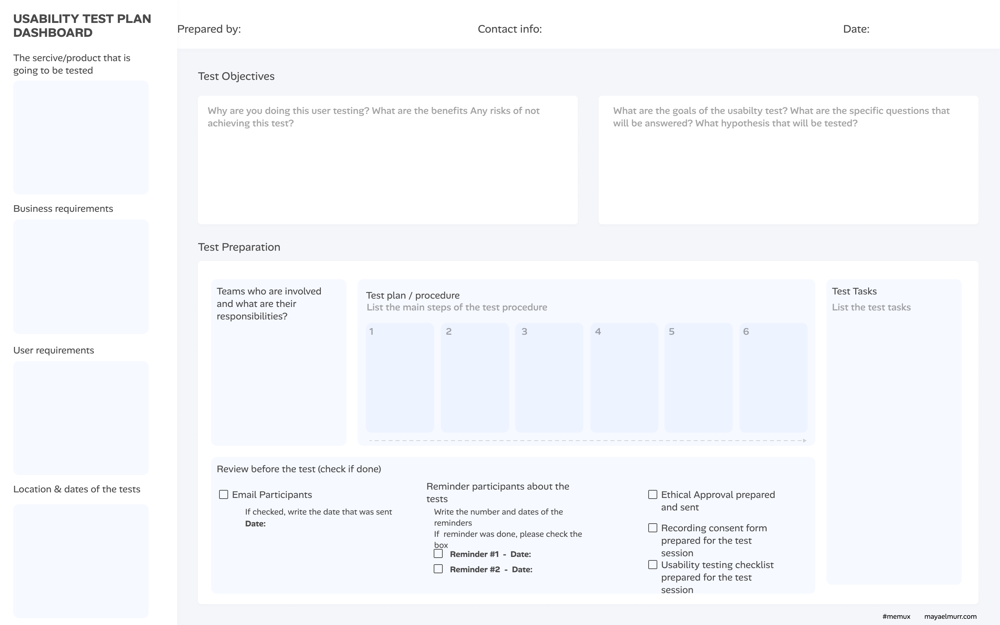
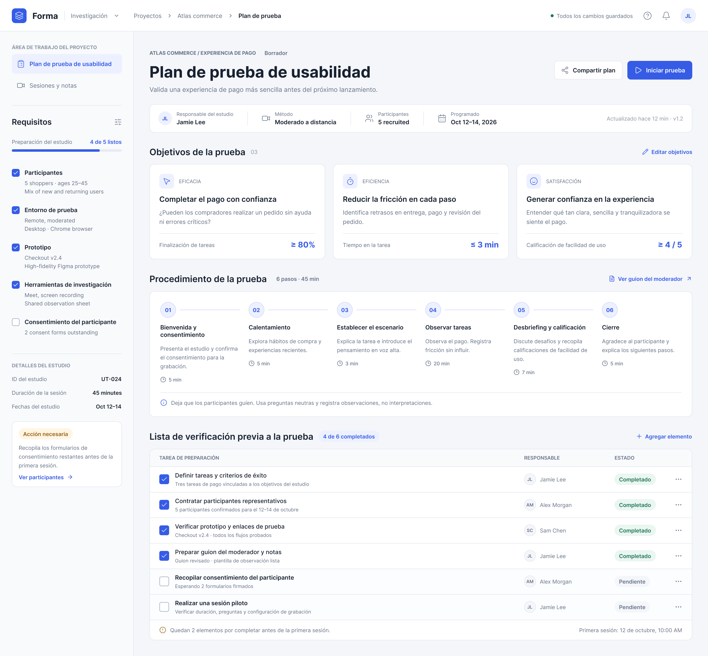
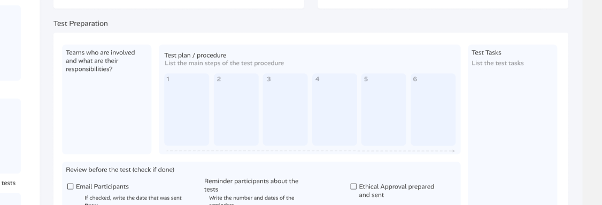
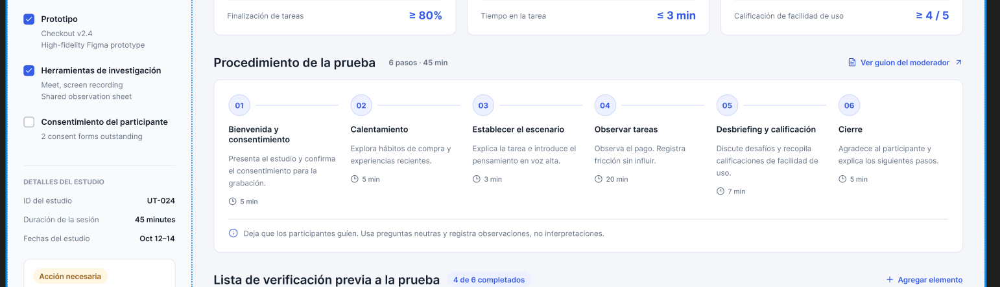
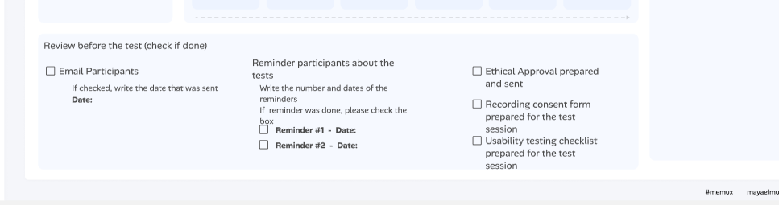
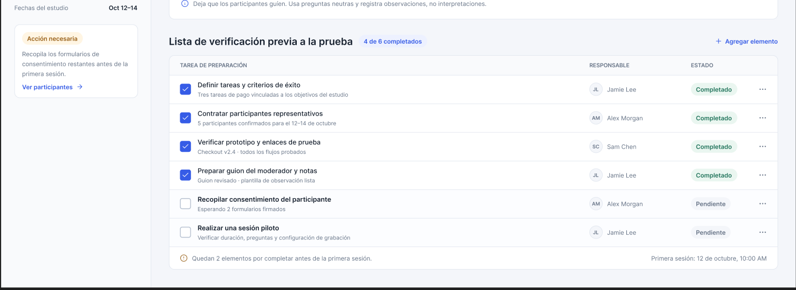

# 🎨 Rediseño del Prototipo: Usability Test Plan Dashboard
**Responsable:** Sebastian Santana

## 🕶 1. Identificación de Problemas en el Diseño Inicial
Al analizar la versión original del dashboard, se detectaron las siguientes oportunidades de mejora:
*   **Jerarquía visual plana:** Los bloques de texto y áreas de entrada carecen de diferenciación visual clara, pareciendo más un formulario para imprimir que una interfaz digital interactiva.
*   **Uso del espacio y contraste deficiente:** Los fondos gris claro sobre blanco carecen de la profundidad necesaria para destacar las áreas de trabajo principal.
*   **Agrupación y alineación (Ley de Proximidad de Gestalt):** El área de "Review before the test" está desordenada visualmente; los checkboxes y las fechas de recordatorio no están alineados correctamente, lo que aumenta la carga cognitiva del usuario.

## 📑 2. Soluciones Aplicadas al Prototipo Corregido
### Propuestas de Mejora Concretas

**1. Reestructuración de la Jerarquía Visual mediante la Ley de Región Común (Gestalt)**
*   **Problema detectado:** El diseño original presenta múltiples cajas grises planas ("Business requirements", "Test Objectives", etc.) sin distinción de importancia, simulando un formulario de papel impreso. Esto genera una alta carga cognitiva.
*   **Propuesta de mejora:** Transformar la interfaz en un dashboard digital real utilizando un sistema de tarjetas (*Card UI*) con sombras sutiles (Drop shadows). Esto separa claramente la barra lateral de configuración (requisitos) del área principal de trabajo (objetivos y procedimientos), guiando la vista del usuario hacia los elementos más importantes primero.

**2. Optimización del Flujo de Tareas aplicando Visibilidad del Estado del Sistema (Nielsen #1)**
*   **Problema detectado:** La sección "Test plan / procedure" muestra los pasos del 1 al 6 como simples rectángulos vacíos y estáticos, sin indicar si es un proceso secuencial o cómo interactuar con ellos.
*   **Propuesta de mejora:** Reemplazar las cajas estáticas por un componente de "Stepper" (Indicador de progreso) interactivo y horizontal. Esto proporciona retroalimentación inmediata sobre en qué paso de la planificación de la prueba de usabilidad se encuentra el equipo, mejorando la navegación y estructurando lógicamente el proceso.

**3. Reducción de Carga Cognitiva mediante Ley de Proximidad y Alineación**
*   **Problema detectado:** En la parte inferior, la sección "Review before the test" tiene checkboxes, textos y campos de fechas (como "Reminder #1 - Date:") completamente desalineados y agrupados de forma confusa.
*   **Propuesta de mejora:** Rediseñar la lista de verificación utilizando una cuadrícula (*Grid*) estricta. Agrupar los elementos lógicamente (por ejemplo, correos, recordatorios y consentimientos éticos) alineando los *checkboxes* a la izquierda y los *inputs* de fechas a la derecha. Esto previene errores de entrada de datos y facilita el escaneo visual rápido.

## 📸 3. Capturas del Prototipo Corregido

**Vista General del Dashboard:**

**Detalle del Flujo de Procedimiento:**
En base al prototipado anterior, aqui se muestra un rediseño enfocado en 6 procedimientos:

**Detalle del Checklist Optimizado:**
Se muestra la lista de verificacion, que se necesita completar antes de una primera sesión:

**Vista General del Dashboard**
Aplicando un rediseño al prototipo, este es el resultado:

---
## 📐 4. Tabla Comparativa: Antes vs. Después

A continuación se detalla la evolución de la interfaz, contrastando el diseño original con el prototipo corregido y fundamentando las decisiones de diseño en principios de Interacción Humano-Computadora (HCI) y experiencia de usuario (UX).

| Componente / Sección | Antes (Versión Original) | Después (Prototipo Corregido) | Justificación Técnica de la Mejora |
| :--- | :--- | :--- | :--- |
| **Jerarquía y Estructura General** |   |   | **Ley de Región Común (Gestalt):** Se agrupó la información relacionada dentro de tarjetas (Card UI) con sombras sutiles. Esto crea profundidad y separa visualmente los requisitos de los objetivos, reduciendo la carga cognitiva. |
| **Flujo de Procedimiento (Test Plan)** |   |   | **Visibilidad del estado del sistema (Nielsen #1):** Se reemplazaron las cajas estáticas por un *Stepper* (indicador de progreso) interactivo. Esto comunica claramente la secuencialidad del proceso y en qué etapa se encuentra el equipo. |
| **Lista de Verificación (Checklist Inferior)** |   |   | **Ley de Proximidad y Alineación:** Se implementó una cuadrícula (*Grid*) estricta para alinear los *checkboxes* a la izquierda y agrupar lógicamente los recordatorios y consentimientos. Esto optimiza el escaneo visual y previene errores del usuario. |
