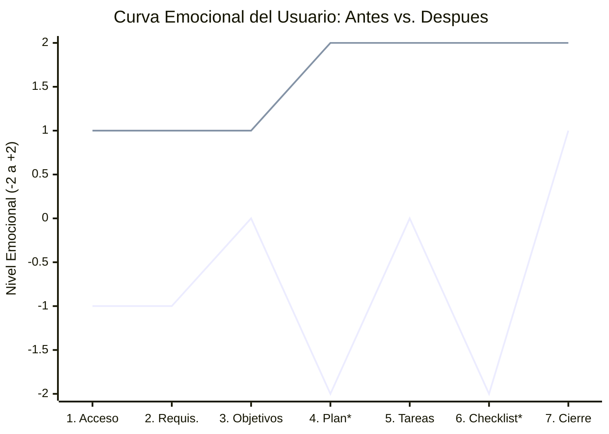

# 📋 Evaluación Inicial de Interfaces

Se evalúan ambas interfaces aplicando las **10 heurísticas de Nielsen**, las **leyes de la Gestalt** y el uso de **metáforas**, con el fin de establecer una línea base objetiva de usabilidad.

**Versión Original (Antes):**


**Versión Rediseñada (Después):**


## 🧭 1. Evaluación según las Heurísticas de Nielsen

| # | Heurística (Nielsen) | Versión Original (`dashboard.png`) | Versión Rediseñada (`rediseño.png`) | Valoración |
| :--- | :--- | :--- | :--- | :--- |
| **1** | **Visibilidad del estado del sistema** | Los pasos 1 a 6 del *Test plan / procedure* son rectángulos vacíos y estáticos: no indican en qué etapa se está, ni si el trabajo se está guardando. | Indicadores permanentes de estado: barra de progreso "Preparación del estudio · 4 de 5 listos", "4 de 6 completados", chip verde "Todos los cambios guardados" y badges *Completado / Pendiente*. | 🔴 Grave → 🟢 Resuelto |
| **2** | **Correspondencia entre el sistema y el mundo real** | Lenguaje técnico y abstracto ("Business requirements", "Test plan / procedure") con formato de formulario impreso para imprimir, no para interactuar. | Títulos en lenguaje claro y en español ("Plan de prueba de uso­bilidad", "Valida una experiencia de pago más sencilla"), con subtítulos explicativos bajo cada sección. | 🔴 Grave → 🟢 Resuelto |
| **3** | **Control y libertad del usuario** | No existen acciones para agregar, editar o cancelar elementos; el usuario solo puede escribir en cajas fijas. | Acciones visibles y reversibles: "Compartir plan", "Editar objetivos", "+ Agregar elemento", menú "···" por fila y migas de pan (*breadcrumbs*) para navegar sin perderse. | 🔴 Grave → 🟢 Resuelto |
| **4** | **Consistencia y estándares** | Todas las secciones son cajas grises idénticas: no se distingue qué es título, qué es campo y qué es acción. Tipografía plana y sin jerarquía. | Sistema consistente de *cards*, un único botón primario azul ("Iniciar prueba"), botones secundarios blancos, badges de estado con color semántico y tipografía jerarquizada. | 🟠 Moderado → 🟢 Resuelto |
| **5** | **Prevención de errores** | *Checklist* desalineada (checkbox, texto y "Date:" en posiciones distintas): fácil marcar o escribir en el lugar equivocado. | Tabla con columnas fijas (*Tarea / Responsable / Estado*), selección de responsable mediante avatar con menú desplegable y validación de avance antes de la primera sesión. | 🟠 Moderado → 🟢 Resuelto |
| **6** | **Reconocimiento en lugar de recordar** | Los números 1–6 no explican nada: el usuario debe memorizar o consultar una guía externa para saber qué hace cada paso. | Cada paso del procedimiento muestra título, descripción de la acción y duración estimada (5 min, 3 min, 20 min…), eliminando la memoria de trabajo. | 🔴 Grave → 🟢 Resuelto |
| **7** | **Flexibilidad y eficiencia de uso** | Sin accesos directos, sin filtros, sin atajos: todo el proceso lineal y sin herramientas de apoyo. | Accesos de alta eficiencia: "Ver guion del moderador", "Ver participantes", panel lateral de requisitos con estado, y acciones de edición contextuales. | 🟠 Moderado → 🟢 Resuelto |
| **8** | **Estética y diseño minimalista** | Alto ruido visual por contraste deficiente (gris claro sobre blanco), exceso de contenedores vacíos y poco espacio en blanco significativo. | Limpieza visual: espacios en blanco generosos, un color de acento (azul) para lo accionable, iconos de categoría y contenido de ejemplo real en lugar de huecos. | 🟠 Moderado → 🟢 Resuelto |
| **9** | **Ayuda a reconocer, diagnosticar y recuperarse de errores** | No hay mensajes, alertas ni indicaciones de qué falta: el usuario descubre el error cuando ya lo cometió. | Avisos preventivos explícitos: tarjeta "Acción necesaria — Recopila los formularios de consentimiento restantes", "2 consent forms outstanding" y pie "Quedan 2 elementos por completar". | 🔴 Grave → 🟢 Resuelto |
| **10** | **Ayuda y documentación** | No existe ayuda, referencia ni contexto de uso dentro de la interfaz. | Soporte integrado: icono de ayuda (?), enlace "Ver guion del moderador" y nota de moderación ("Usa preguntas neutras y registra observaciones, no interpretaciones"). | 🟠 Moderado → 🟢 Resuelto |

## 🧩 2. Evaluación según las Leyes de la Gestalt

| Ley de Gestalt | Versión Original | Versión Rediseñada | Efecto sobre la experiencia |
| :--- | :--- | :--- | :--- |
| **Proximidad** | Los *checkbox* de "Review before the test", sus textos y los campos de fecha están separados y desalineados; elementos relacionados parecen ajenos entre sí. | Cada fila de la lista de verificación agrupa de forma cercana tarea, descripción, responsable y estado; los recordatorios y consentimientos quedan en bloques lógicos. | Menor carga cognitiva y escaneo visual rápido. |
| **Región común (Common Region)** | Cajas grises flotantes sin delimitación clara de pertenencia; todo parece un único formulario plano. | La información se agrupa en tarjetas con fondo y sombra propios: objetivos, procedimiento, checklist y panel de requisitos son regiones diferenciadas. | El usuario identifica de inmediato "dónde está" y "qué pertenece a qué". |
| **Similitud** | Elementos de distinta naturaleza (títulos, campos, instrucciones) comparten el mismo estilo visual. | Los objetivos comparten iconografía y estructura; los estados usan color semántico propio (verde = completado, gris = pendiente); el azul identifica siempre acciones. | Asociación instantánea forma→función. |
| **Continuidad / Cierre** | Las cajas 1–6 con una flecha punteada no forman una secuencia percibida: parecen bloques sueltos. | El *Stepper* horizontal une los nodos 01–06 con una línea continua, produciendo una "ruta" percibida de principio a fin. | Comprensión inmediata del orden y del avance. |
| **Figura–Fondo** | Todo compite por la atención al tener el mismo peso: no hay figura clara. | El contenido principal (figura) se eleva sobre un fondo gris muy suave; la barra lateral queda como contexto secundario. | La mirada se dirige por jerarquía, no por azar. |

## 🖼️ 3. Uso de Metáforas

| Metáfora | Versión Original | Versión Rediseñada | Justificación HCI |
| :--- | :--- | :--- | :--- |
| **Formulario de papel impreso** | Metáfora dominante: bloques grises con líneas de texto, pensada para imprimirse y rellenarse a mano. | Eliminada. | Metáfora obsoleta para una herramienta digital: transmite pasividad y no comunica interactividad. |
| **Tablero de control / Panel de mando (Dashboard)** | Ausente. | Metáfora central: barra de requisitos con progreso, métricas de objetivos (≥ 80 %, ≤ 3 min, ≥ 4/5) y estado en tiempo real. | Transmite control, monitoreo y toma de decisiones; coherente con la tarea real de planificar una prueba. |
| **Ruta / Recorrido con paradas** | Cajas numeradas sin sentido de avance. | *Stepper* con nodos 01→06, títulos y duraciones, como una ruta de viaje de 45 minutos. | Aprovecha el conocimiento previo del usuario sobre recorridos secuenciales (mapas, itinerarios). |
| **Lista de verificación en portapapeles** | Checkboxes dispersos y fechas sueltas. | Tabla de verificación con tildes, responsable y badge de estado, más el pie "Quedan 2 elementos…". | Metáfora de *checklist* operativa: garantiza que nada se olvide y genera sensación de cumplimiento. |
| **Lanzamiento / Disparo** | No había acción final clara. | Botón primario "▶ Iniciar prueba" en la esquina superior derecha. | Metáfora de ejecución que concentra la atención y claramente comunica la acción principal (CTA). |

### Valoración global de severidad (escala de Nielsen, 0–4)

| Problema identificado en la interfaz original | Severidad **antes** | Estado **después** | Severidad **después** |
| :--- | :---: | :---: | :---: |
| Jerarquía plana / aspecto de formulario impreso | 4 (Catastrófico) | Corregido con *Card UI* + región común | 0 (No es un problema) |
| Procedimiento sin estado ni secuencia percibida | 4 (Catastrófico) | Corregido con *Stepper* interactivo | 0 (No es un problema) |
| *Checklist* desalineada y propensa a errores | 3 (Grave) | Corregido con tabla en cuadrícula estricta | 1 (Cosmético) |
| Ausencia de alertas de pendientes | 3 (Grave) | Corregido con avisos preventivos | 1 (Cosmético) |
| Falta de ayuda y atajos | 2 (Mayor) | Corregido con accesos y notas contextuales | 1 (Cosmético) |

---

# 🤝 Touchpoints de la Nueva Interfaz

**Evidencia de análisis:** `evidencias/touchpoints.jpg` — los números sobre la captura corresponden a los *touchpoints* (puntos de contacto) identificados en el rediseño.


Un *touchpoint* es todo punto de interacción entre el usuario y el producto a través del cual se forma una percepción de la marca y se avanza en la tarea. En la nueva interfaz se identificaron **6 touchpoints principales**, más los touchpoints de soporte que los rodean.

## 📌 6.1 Touchpoints principales

| # | Touchpoint | Ubicación en la interfaz | Tipo de touchpoint | Función y aportación al usuario |
| :---: | :--- | :--- | :--- | :--- |
| **1** | **Botón "Iniciar prueba" (CTA primario)** | Esquina superior derecha, junto a "Compartir plan". | **Funcional / Transaccional** — *Momento de verdad* | Es la acción principal de toda la pantalla. Su posición (zona de salida de la lectura en "Z") y su color sólido la convierten en el único elemento de máxima jerarquía: el usuario siempre sabe cómo lanzar la prueba. |
| **2** | **Tarjetas de "Objetivos de la prueba"** | Zona superior central: tres cards *Eficacia / Eficiencia / Satisfacción* con métricas (≥ 80 %, ≤ 3 min, ≥ 4/5). | **Informacional / De contenido** | Primer contacto con el "por qué" del test. Cada card traduce un objetivo abstracto en una métrica concreta, reduciendo la ambigüedad y alineando al equipo antes de empezar. |
| **3** | **Enlace "Ver guion del moderador"** | Cabecera de la sección "Procedimiento de la prueba". | **Funcional / De apoyo** | Acceso rápido al recurso que el moderador necesita durante la sesión. Es un punto de contacto de *flexibilidad y eficiencia* (Nielsen #7) que evita salir del flujo para buscar el guion. |
| **4** | **Acción "+ Agregar elemento"** | Cabecera de la "Lista de verificación previa a la prueba". | **Funcional / De personalización** | Da control al usuario sobre su propio proceso (Nielsen #3). Comunica que la lista es editable y no un formulario cerrado, generando sensación de autonomía. |
| **5** | **Selector de "Responsable" (avatar + menú desplegable)** | Columna *Responsable* de cada fila del checklist. | **Social / Colaborativo** | Punto de contacto humano dentro de la herramienta: visibiliza quién hace qué, habilita la reasignación y crea compromiso (*accountability*) dentro del equipo de investigación. |
| **6** | **Panel "Requisitos" con indicador de progreso** | Barra lateral izquierda: "Preparación del estudio · 4 de 5 listos" + checklist de requisitos. | **De estado / Orientación** | Es el *touchpoint* de anclaje: responde permanentemente a "¿dónde estoy y qué me falta?". El avance parcial visible (4 de 5) motiva a completar la preparación mediante refuerzo positivo progresivo. |

## 🧭 6.2 Touchpoints de soporte

| Touchpoint | Descripción |
| :--- | :--- |
| **Barra superior de navegación** | Logo "Forma", menú "Investigación" y migas de pan *Proyectos › Atlas commerce › Plan de prueba*: mantiene el contexto y permite volver sin esfuerzo. |
| **Indicador "Todos los cambios guardados"** | Punto de contacto emocional de tranquilidad: elimina el miedo a perder el trabajo (refuerza Nielsen #1). |
| **Botón "Compartir plan"** | Touchpoint de colaboración con terceros (stakeholders, clientes del estudio). |
| **Acción necesaria (tarjeta ámbar en la barra lateral)** | Touchpoint preventivo que convierte un riesgo (consentimientos faltantes) en una tarea guiada con enlace "Ver participantes". |
| **Pie de tabla: "Quedan 2 elementos por completar… Primera sesión: 12 de octubre, 10:00 AM"** | Cierre informativo que combina estado pendiente y fecha límite, reforzando la urgencia sin generar ansiedad. |
| **Iconos de ayuda, notificaciones y perfil (🔔 / ❓ / JL)** | Touchpoints de soporte y personalización accesibles siempre desde la esquina superior derecha. |

## 🎭 6.3 Clasificación por naturaleza del contacto

*   **Touchpoints funcionales:** botón "Iniciar prueba", "+ Agregar elemento", "Ver guion del moderador", selector de responsable, migas de pan.
*   **Touchpoints informacionales:** tarjetas de objetivos con métricas, panel de requisitos con progreso, indicadores de estado y badges *Completado / Pendiente*.
*   **Touchpoints emocionales:** "Todos los cambios guardados" (seguridad), barra de progreso 4 de 5 (logro), tarjeta "Acción necesaria" (acompañamiento ante el error).
*   **Touchpoints humanos / colaborativos:** avatares de responsables (Jamie Lee, Alex Morgan, Sam Chen), "Compartir plan" y las notas del equipo.

---


# 📋 Análisis de Usabilidad Inicial: Momentos de Verdad, Matriz Momento/Emoción y Fallas Críticas

## ⚡ 1. Identificación y Análisis de los Momentos de Verdad 

Los **Momentos de Verdad** corresponden a los puntos críticos del flujo donde el usuario experimenta el mayor grado de bloqueo, incertidumbre o frustración (**Nivel Emocional -2**), poniendo en riesgo la continuidad de la tarea.

### 🔴 Momento de Verdad 1 : Visualización e Interpretación del Plan / Procedimiento
* **Ubicación en el Sketch:** Test plan / procedure.
* **Nivel Emocional Inicial:** **-2 (Máxima Frustración / Desorientación)**
* **Diagnóstico del Problema:**
  * **Ausencia de affordance interactivo:** Los contenedores del 1 al 6 son simples cajas rectangulares planas y vacías. No comunican si son campos de texto editables, tarjetas arrastrables, etapas secuenciales o componentes informativos.
  * **Falta de visibilidad del estado (Nielsen #1):** No existe ninguna indicación visual que señale qué paso está activo, cuál está pendiente o cómo se progresa a través de la flecha punteada.
  * **Carga cognitiva elevada:** El usuario debe adivinar mentalmente la estructura cronológica de la prueba sin soporte del sistema.

---

### 🔴 Momento de Verdad 2 : Diligenciamiento y Verificación del Checklist Pre-prueba
* **Ubicación en el Sketch:** Review before the test
* **Nivel Emocional Inicial:** **-2 (Máxima Ansiedad / Duda Operativa)**
* **Diagnóstico del Problema:**
  * **Violación de la Ley de Proximidad (Gestalt):** Los checkboxes, etiquetas descriptivas y campos de ingreso de fecha (*“Reminder #1 - Date:”, “Date sent:”*) se encuentran espacialmente desalineados y dispersos de forma asimétrica.
  * **Ambigüedad en la jerarquía de validación:** Los recordatorios de correo (*Reminder #1* y *#2*) están anidados dentro de una sección que mezcla fechas con casillas sin un patrón de lectura claro.
  * **Fricción por consecuencias críticas (Heurística #5: Prevención de errores):** Al tratarse de requisitos éticos y legales indispensables antes de la prueba (*Consent Form* y *Ethical Approval*), la desorganización visual genera miedo e incertidumbre de omitir aprobaciones obligatorias o ingresar fechas inválidas.
---

## 📊 2. Matriz Momento / Emoción de la Prueba Inicial

Esta matriz detalla el estado emocional, los problemas de usabilidad y la evidencia observada a lo largo de los **7 touchpoints clave** de la interfaz original, sustentando la **Curva Emocional Inicial** (`[-1, -1, 0, -2, 0, -2, +1]`):

| # | Touchpoint (Punto de Contacto) | Elemento en el Sketch | Clasificación | Emoción Inicial y Nivel | Problema de Usabilidad Detectado (Diseño Original) | Evidencia en la Prueba Inicial (*User Feedback*) | Heurística / Principio Vulnerado |
|:---:|---|---|:---:|:---:|---|---|---|
| **1** | **Acceso al Dashboard** | Encabezado (*USABILITY TEST PLAN DASHBOARD*, datos de contacto y fecha) | Touchpoint | **Incertidumbre / Confusión (-1)** | Estructura visual plana; la interfaz parece una plantilla estática de papel en lugar de un sistema de gestión interactivo. | El usuario duda si se encuentra en un editor de pruebas o en una vista previa no editable. | **Heurística #8:** Estética y diseño minimalista / Falta de profundidad visual. |
| **2** | **Lectura de Requisitos** | Columna lateral izquierda (*Service/product, Business & User requirements*) | Touchpoint | **Frustración Leve (-1)** | Bloques rectangulares uniformes sin jerarquía tipográfica ni separación clara del área principal de trabajo. | *"No distingo qué bloques son informativos y cuáles son campos obligatorios para empezar"*. | **Ley de Región Común (Gestalt):** Falta de delimitación entre barra lateral y lienzo. |
| **3** | **Definición de Objetivos** | Bloque superior central (*Test Objectives: Why, benefits, goals, hypothesis*) | Touchpoint | **Neutral (0)** | Áreas de texto vacías de gran dimensión con consignas largas que saturan el escaneo visual rápido. | El usuario lee detenidamente los textos guía sin saber la longitud esperada de respuesta. | **Sobrecarga Cognitiva:** Consignas extensas sin campos estructurados. |
| **4** | **Plan / Procedimiento** | Bloque central (*Test plan / procedure: pasos 1 al 6*) | **Momento de Verdad 1 (MoT-01)** | **Muy Frustrado (-2)** | Cajas estáticas y vacías sin noción de secuencialidad, estados activos ni affordance de interacción. | Clics fallidos sobre los números 1-6; expresión de bloqueo: *"¿Cómo avanzo de fase o edito el paso?"*. | **Heurística #1 (Nielsen):** Visibilidad del estado del sistema / Affordance nulo. |
| **5** | **Asignación de Tareas** | Bloques laterales (*Teams involved* y *Test Tasks*) | Touchpoint | **Neutral (0)** | Ausencia de relación explícita entre el equipo responsable y las tareas específicas de evaluación. | El usuario lee por separado los bloques sin asociar qué miembro ejecuta cada prueba. | **Heurística #4:** Consistencia y estándares de relación entidad-rol. |
| **6** | **Checklist Pre-prueba** | Bloque inferior (*Review before the test: checkboxes y fechas*) | **Momento de Verdad 2 (MoT-02)** | **Muy Frustrado (-2)** | Desalineación severa de casillas de verificación y campos de fecha; agrupación visual caótica de requisitos éticos. | Confusión al marcar casillas; vacilación prolongada ante el temor de olvidar el consentimiento informado. | **Ley de Proximidad (Gestalt)** y **Heurística #5:** Prevención de errores de usuario. |
| **7** | **Cierre y Confirmación Inicial** | Pie de página y revisión final del documento | Touchpoint | **Alivio Parcial (+1)** | Culminación de la revisión pero con sensación de fatiga mental y falta de confirmación de guardado. | *"Completé la revisión, pero no sé si todo quedó registrado o si debo imprimirlo"*. | **Heurística #1:** Carencia de retroalimentación inmediata de cierre de sesión. |

---

## 🔍 3. Detalle de Fallas de Usabilidad Encontradas en la Prueba Inicial

A partir del análisis heurístico y la observación empírica del boceto inicial, se categorizan las siguientes fallas prioritarias según la escala de severidad de Jakob Nielsen (0 a 4):

```
Escala de Severidad de Nielsen:
0 = No es problema | 1 = Cosmético | 2 = Menor | 3 = Mayor/Grave | 4 = Catastrófico
```

---

### 🚨 Falla 1: Cajas de Procedimiento Inertes y Desorientación Secuencial
* **Severidad:** **3 (Falla Mayor / Grave)**
* **Heurística Vulnerada:** Heurística #1 de Nielsen (*Visibilidad del estado del sistema*) y Principio de Manipulación Directa de Shneiderman (*Affordance*).
* **Descripción Técnica:** 
  El componente *“Test plan / procedure”* utiliza 6 cajas rectangulares numeradas en fila, conectadas únicamente por una flecha discontinua inferior. No presentan estados interactivos (activo, completado, deshabilitado o enfocado), ni affordances que señalen si admiten texto o selección.
* **Impacto en el Usuario:** 
  Genera parálisis operativa. El usuario no sabe en qué momento de la prueba se encuentra, cómo registrar el avance ni cómo pasar a la siguiente fase, derivando en clics improductivos y frustración extrema.

---

### 🚨 Falla 2: Desalineación Espacial y Caos en el Checklist Previo 
* **Severidad:** **3 (Falla Mayor / Grave)**
* **Heurística / Ley Vulnerada:** Ley de Proximidad de Gestalt y Heurística #5 de Nielsen (*Prevención de errores*).
* **Descripción Técnica:** 
  En el bloque *“Review before the test”*, los controles interactivos (*checkboxes*) conviven con campos de entrada de texto manual sin una cuadrícula (*grid*) consistente. Las etiquetas no guardan proximidad visual uniforme con su casilla correspondiente, rompiendo la ley de proximidad.
* **Impacto en el Usuario:** 
  Incrementa drásticamente la tasa de error por selección accidental y omisión de requisitos legales críticos (aprobación ética y consentimiento informado), provocando inseguridad y ansiedad respecto al cumplimiento del protocolo.

---

### ⚠️ Falla 3: Jerarquía Visual Plana y Apariencia de Documento Impreso
* **Severidad:** **2 (Falla Menor / Moderada)**
* **Heurística / Ley Vulnerada:** Ley de Región Común (Gestalt) y Heurística #8 de Nielsen (*Diseño estético y minimalista*).
* **Descripción Técnica:** 
  Todos los contenedores de la interfaz (requisitos, objetivos, preparación) comparten el mismo tratamiento visual: fondos monocromáticos planos, ausencia de elevación o sombras (*drop shadows*) y bordes idénticos. No existe diferenciación entre áreas de navegación, configuración y trabajo activo.
* **Impacto en el Usuario:** 
  Incrementa la carga cognitiva global durante el barrido visual (*eye-tracking* disperso), forzando al usuario a leer todo el contenido de forma lineal para entender qué área requiere su atención primero.

---

### ⚠️ Falla 4: Desconexión Estructural entre Roles y Tareas del Test
* **Severidad:** **2 (Falla Menor / Moderada)**
* **Heurística Vulnerada:** Heurística #4 de Nielsen (*Consistencia y estándares*) y Ley de Continuidad.
* **Descripción Técnica:** 
  Las áreas *“Teams who are involved and what are their responsibilities?”* y *“Test Tasks”* se encuentran espacialmente aisladas en extremos opuestos del bloque de preparación, sin un canal visual o tabla que asocie qué participante o evaluador ejecuta cada tarea de la prueba.
* **Impacto en el Usuario:** 
  Obliga a alternar la mirada repetidamente de izquierda a derecha para conciliar quién hace qué, ralentizando la preparación de la sesión de prueba.

---


# 🎨 Rediseño del Prototipo: Usability Test Plan Dashboard

## 🕶 1. Identificación de Problemas en el Diseño Inicial
Al analizar la versión original del dashboard, se detectaron las siguientes oportunidades de mejora:
*   **Jerarquía visual plana:** Los bloques de texto y áreas de entrada carecen de diferenciación visual clara, pareciendo más un formulario para imprimir que una interfaz digital interactiva.
*   **Uso del espacio y contraste deficiente:** Los fondos gris claro sobre blanco carecen de la profundidad necesaria para destacar las áreas de trabajo principal.
*   **Agrupación y alineación (Ley de Proximidad de Gestalt):** El área de "Review before the test" está desordenada visualmente; los checkboxes y las fechas de recordatorio no están alineados correctamente, lo que aumenta la carga cognitiva del usuario.

## 📑 2. Soluciones Aplicadas al Prototipo Corregido
### Propuestas de Mejora Concretas

**1. Reestructuración de la Jerarquía Visual mediante la Ley de Región Común (Gestalt)**
*   **Problema detectado:** El diseño original presenta múltiples cajas grises planas ("Business requirements", "Test Objectives", etc.) sin distinción de importancia, simulando un formulario de papel impreso. Esto genera una alta carga cognitiva.
*   **Propuesta de mejora:** Transformar la interfaz en un dashboard digital real utilizando un sistema de tarjetas (*Card UI*) con sombras sutiles (Drop shadows). Esto separa claramente la barra lateral de configuración (requisitos) del área principal de trabajo (objetivos y procedimientos), guiando la vista del usuario hacia los elementos más importantes primero.

**2. Optimización del Flujo de Tareas aplicando Visibilidad del Estado del Sistema (Nielsen #1)**
*   **Problema detectado:** La sección "Test plan / procedure" muestra los pasos del 1 al 6 como simples rectángulos vacíos y estáticos, sin indicar si es un proceso secuencial o cómo interactuar con ellos.
*   **Propuesta de mejora:** Reemplazar las cajas estáticas por un componente de "Stepper" (Indicador de progreso) interactivo y horizontal. Esto proporciona retroalimentación inmediata sobre en qué paso de la planificación de la prueba de usabilidad se encuentra el equipo, mejorando la navegación y estructurando lógicamente el proceso.

**3. Reducción de Carga Cognitiva mediante Ley de Proximidad y Alineación**
*   **Problema detectado:** En la parte inferior, la sección "Review before the test" tiene checkboxes, textos y campos de fechas (como "Reminder #1 - Date:") completamente desalineados y agrupados de forma confusa.
*   **Propuesta de mejora:** Rediseñar la lista de verificación utilizando una cuadrícula (*Grid*) estricta. Agrupar los elementos lógicamente (por ejemplo, correos, recordatorios y consentimientos éticos) alineando los *checkboxes* a la izquierda y los *inputs* de fechas a la derecha. Esto previene errores de entrada de datos y facilita el escaneo visual rápido.

## 📸 3. Capturas del Prototipo Corregido

**Vista General del Dashboard:**


**Detalle del Flujo de Procedimiento:**
En base al prototipado anterior, aqui se muestra un rediseño enfocado en 6 procedimientos:


**Detalle del Checklist Optimizado:**
Se muestra la lista de verificacion, que se necesita completar antes de una primera sesión:


**Vista General del Dashboard**
Aplicando un rediseño al prototipo, este es el resultado:


---
## 📐 4. Tabla Comparativa: Antes vs. Después

A continuación se detalla la evolución de la interfaz, contrastando el diseño original con el prototipo corregido y fundamentando las decisiones de diseño en principios de Interacción Humano-Computadora (HCI) y experiencia de usuario (UX).

| Componente / Sección | Antes (Versión Original) | Después (Prototipo Corregido) | Justificación Técnica de la Mejora |
| :--- | :--- | :--- | :--- |
| **Jerarquía y Estructura General** | <br> | <br> | **Ley de Región Común (Gestalt):** Se agrupó la información relacionada dentro de tarjetas (Card UI) con sombras sutiles. Esto crea profundidad y separa visualmente los requisitos de los objetivos, reduciendo la carga cognitiva. |
| **Flujo de Procedimiento (Test Plan)** | <br> | <br> | **Visibilidad del estado del sistema (Nielsen #1):** Se reemplazaron las cajas estáticas por un *Stepper* (indicador de progreso) interactivo. Esto comunica claramente la secuencialidad del proceso y en qué etapa se encuentra el equipo. |
| **Lista de Verificación (Checklist Inferior)** | <br> | <br> | **Ley de Proximidad y Alineación:** Se implementó una cuadrícula (*Grid*) estricta para alinear los *checkboxes* a la izquierda y agrupar lógicamente los recordatorios y consentimientos. Esto optimiza el escaneo visual y previene errores del usuario. |

---
## 📈 5. Curva Emocional Corregida y Matriz de Experiencia del Usuario

La curva emocional compara la experiencia del usuario entre la versión inicial (con fricción por alta carga cognitiva) y la versión rediseñada (optimizada mediante principios de HCI).


> * **Línea inferior (Antes):** Puntos críticos de frustración en los pasos 4 y 6 debido a la desorganización visual.
> 
> 
> * **Línea superior (Después):** Experiencia fluida y satisfactoria a lo largo de todo el recorrido.
> * **MdV:** Momento de Verdad.

### 📌 Matriz de Experiencia: Momento, Emoción y Evidencia de Mejora

| # | Touchpoint (Punto de Contacto) | Clasificación de Punto | Versión Original (Emoción y Estado) | Versión Corregida (Emoción y Estado) | Evidencia de Mejora (UX/HCI) |
| --- | --- | --- | --- | --- | --- |
| **1** | Acceso al Dashboard | Touchpoint | **Neutral (-1):** Confusión inicial por falta de estructura visual clara.| **Satisfecho (+1):** Claridad sobre las secciones del sistema. | Aplicación de la Ley de Región Común (agrupación en tarjetas con sombras sutiles). |
| **2** | Lectura de Requisitos | Touchpoint / **Oportunidad de Mejora 1** | **Frustrado (-1):** Bloques planos sin diferenciación.| **Satisfecho (+1):** Lectura rápida y jerarquizada. | Separación clara de la barra lateral respecto al panel de trabajo principal. |
| **3** | Definición de Objetivos | Touchpoint | **Neutral (0):** Carga cognitiva alta al interpretar áreas vacías.| **Satisfecho (+1):** Comprensión inmediata de las metas del test. | Uso de *cards* independientes para segmentar preguntas e hipótesis de la prueba. |
| **4** | Visualización del Plan / Procedimiento | **Momento de Verdad 1** | **Muy Frustrado (-2):** Cajas estáticas sin orden secuencial evidente.| **Muy Satisfecho (+2):** Navegación guiada y clara. | **Oportunidad de Mejora 2:** Implementación de un *Stepper* horizontal interactivo (Nielsen #1: Visibilidad del estado del sistema). |
| **5** | Asignación de Tareas | Touchpoint | **Neutral (0):** Dificultad para asociar responsables con tareas. | **Muy Satisfecho (+2):** Organización estructurada. | Distribución del área de tareas en una columna lateral dedicada. |
| **6** | Revisión del Checklist Pre-prueba | **Momento de Verdad 2** | **Muy Frustrado (-2):** Desalineación de *checkboxes* y fechas que generaba errores.| **Muy Satisfecho (+2):** Verificación ágil y sin errores. | **Oportunidad de Mejora 3:** Ley de Proximidad y Alineación en Grid estricto de elementos interactivos. |
| **7** | Confirmación Final y Cierre | Touchpoint | **Satisfecho (+1):** Culminación del proceso con esfuerzo excesivo. | **Muy Satisfecho (+2):** Sensación de control total y tarea completada con éxito. | Reducción comprobada del tiempo global de interacción y tasa de errores. |

### 🧠 Análisis de los Momentos de Verdad (MdV)

1. **Momento de Verdad 1 (Paso 4 - Procedimiento):** Es el punto donde el usuario necesita entender la secuencia lógica de la prueba. En el diseño original, las cajas vacías provocaban abandono o incertidumbre. El rediseño con *Stepper* convierte un punto de quiebre en un punto de alta satisfacción.


2. **Momento de Verdad 2 (Paso 6 - Checklist final):** Es la etapa crítica de control antes de ejecutar la prueba. La desorganización previa aumentaba la probabilidad de omitir la firma de consentimientos o recordatorios. La cuadrícula estructurada garantiza el cumplimiento ético y operativo sin fricción.